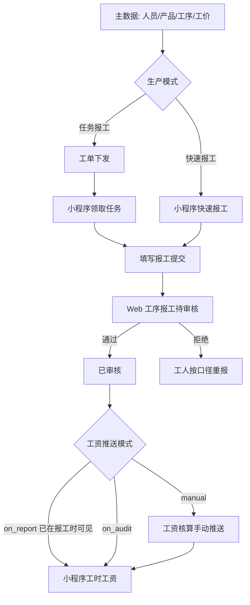

# 流程 · P01 报工工资闭环

## 1. 目标

工人产出可计量 → 主任可审核 → 工资可核算可推送 → 工人/财务可查。

## 2. 适用场景

场景一～五（凡含工资）。场景一可无工单；场景三起建议任务报工。

## 3. 流程图

## 4. 角色与系统动作

| 步骤         | 角色        | 系统位置             |
| ------------ | ----------- | -------------------- |
| 配工价与口径 | 管理员/财务 | 产品工艺；计薪口径表 |
| 配推送模式   | 管理员      | 功能参数 → 工资推送  |
| 下发任务     | 主任        | 生产工单             |
| 报工         | 工人        | 小程序工序报工       |
| 审核         | 主任        | 报工管理 → 工序报工  |
| 确认/补贴    | 主任        | 报工确认             |
| 推送         | 主任/财务   | 工资核算             |
| 查看         | 工人        | 小程序工时工资       |

## 5. 关键配置

- 业务规则：生产模式（标准 / 极简快速 / 极简任务）
- 功能参数：`salaryPushMode`
- 不良是否计薪、多人协作规则（口径表）

## 6. 验收用例

| #   | 步骤                 | 期望                     |
| --- | -------------------- | ------------------------ |
| 1   | 工人提交一笔计件报工 | 状态待审核               |
| 2   | 主任审核通过         | 已审核                   |
| 3   | 按推送模式操作       | 工人可见或核算列表有明细 |
| 4   | 拒绝一笔并填原因     | 工人可重报（若允许）     |
| 5   | 时长报工选计件       | 系统拦截                 |

## 7. 常见断点

1. 推送模式误解（以为审核=到账可见）
2. 工价未维护导致金额为 0 或无法计薪
3. 快速/任务模式与培训不一致
4. 已审核后改数期望落空

## 8. 相关文档

- manuals/05、06、10
- faq 客户 C 节、实施 2 节
- errors 第 2、3 节
