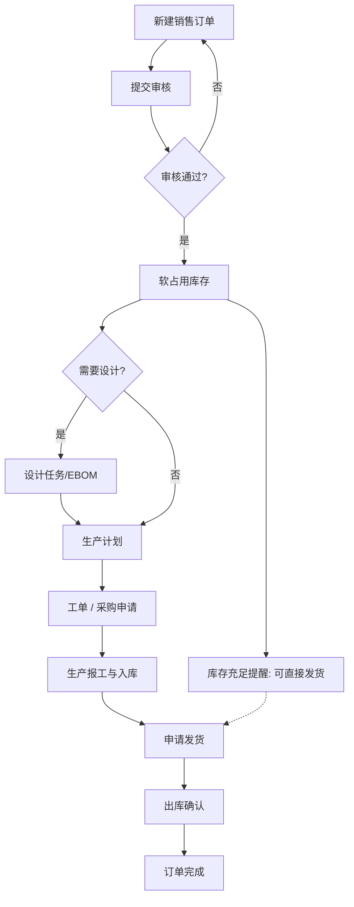

# 流程 · P02 销售订单到发货

## 1. 目标

接单 →（设计）→ 计划/生产/采购协同 → 入库 → 发货出库，全程可追溯。

## 2. 适用场景

场景四、五为主；场景一～三通常不上完整销售驱动。

## 3. 主流程图

## 4. 软占用与补货（要点）

| 时机      | 行为                               |
| --------- | ---------------------------------- |
| 审核通过  | `占用 = min(行需求, 自由备货)`     |
| 入库      | 优先偿还跨单调拨欠量，再补给销售行 |
| 出库确认  | 按出库数量释放占用                 |
| 反审/作废 | 释放整单占用                       |

自由备货 = 现存量 − 全部软占用。

**跨单调拨：** 急单可申请转移他单未发货占用，确认后记偿还欠量。

**补货中心：** 库存预警 → 生成 `BH…` 计划或采购申请。

计划策略「按单/以库存」仅为标签提醒，**不再**作为审核绝不建计划的唯一开关。

## 5. 自动下游单据

功能参数「自动生成单据」+ 物料供应型态：

- 外购 → 采购申请
- 外协 → 外协订单
- 自产 → 生产/总装工单

**实施建议：** 主数据未清洗前先关闭自动生成。

## 6. 发货规则

| 参数     | 行为                                   |
| -------- | -------------------------------------- |
| 按单发货 | 扣本单挂标批次；强制按单行不可拿他单货 |
| FIFO     | 按仓批次先后，不区分本单               |

随货附件：申请发货时或仓管发货时确定；均可在「随货查询」维护。

出厂质检：弱管控预警不拦截（当期）。

## 7. 订单变更与发货互斥

存在待审核订单变更 → 不可申请发货。  
变更数量不可小于已占用发货数量。

## 8. 验收用例

| #   | 用例               | 期望                         |
| --- | ------------------ | ---------------------------- |
| 1   | 标准品订单审核     | 进行中；可生成计划/工单      |
| 2   | 库存被他单占用     | 提醒他单占用；可申请调拨占用 |
| 3   | 本单入库后按单发货 | 扣本单批次成功               |
| 4   | 待审变更时申请发货 | 拦截                         |
| 5   | 反审有已出库 SN    | 禁止反审                     |

## 9. 相关文档

- manuals/03、04
- `docs/yunxiao/...以库存生产MTS场景说明.md`
- `docs/按单发货.md`
