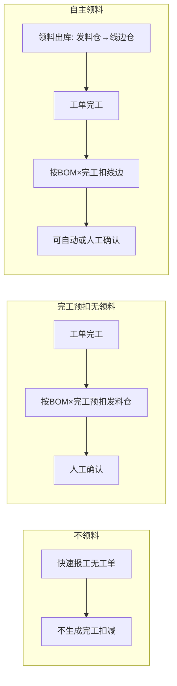

# 流程 · P03 领料、入库与库存扣减

## 1. 目标

料出得去、货进得来、账实一致。对内说清三种扣减模式；对外讲领料与入库。

## 2. 三种库存扣减模式对照



| 模式              | 领料   | 完工扣减 | 自动确认 |
| ----------------- | ------ | -------- | -------- |
| 不领料            | 可不走 | 不生成   | —        |
| 完工后预扣+确认   | 可不走 | 扣发料仓 | **否**   |
| 自主领料+完工预扣 | 要走   | 扣线边仓 | 可       |

下料结算物料：扣减单可能仅展示「下料结算扣减」，实耗在下料结算完成。

## 3. 领料流程

```
发起领料(Web/小程序) → 待审核(可选) → 出库确认(FIFO拣批) → 库存从发料仓减少
自主领料模式下同时增加线边仓
```

自动审批「领料申请」= 免审。

## 4. 成品入库流程

```
工单/快速/批量入库 → 入库单待审(可选) → 审核入库 → 成品仓增加
可挂销售单批次 → 支撑按单发货
```

## 5. 完工扣减流程（对内）

```
工单标记已完成 → 生成库存扣减记录(待确认)
  → 仓管核对仓库/数量
  → 确认通过 → 按明细扣库存
  → 库存不足则行/单失败
```

菜单：**库存管理 → 库存扣减记录**。

## 6. 调拨 / 盘点 / 下料（旁路）

| 流程     | 要点                       |
| -------- | -------------------------- |
| 调拨     | 可要求入库方签收           |
| 盘点     | 小程序录入；PC 审核过账    |
| 下料结算 | 实耗登记；余料回库或留线边 |

## 7. 对外话术（客户问账怎么扣）

「按你们选的领料/报工习惯，系统保证库存账和现场一致；具体扣账在后台按约定规则完成，日常把领料和入库做对即可。」

## 8. 验收用例

| #   | 用例                                | 期望                         |
| --- | ----------------------------------- | ---------------------------- |
| 1   | 场景二：快速领料→报工→成品入库      | 三笔可对上                   |
| 2   | 自主领料：领 10，BOM 耗 8，完工确认 | 线边按规则扣 8（及下料差异） |
| 3   | 倒冲模式点自动确认扣减              | 仍须人工确认                 |
| 4   | 库存不足确认扣减                    | 失败提示，可补库重试         |

## 9. 相关文档

- manuals/07
- reference/01 库存扣减节
- implementation/attachments/实施配置备忘-库存相关.md
