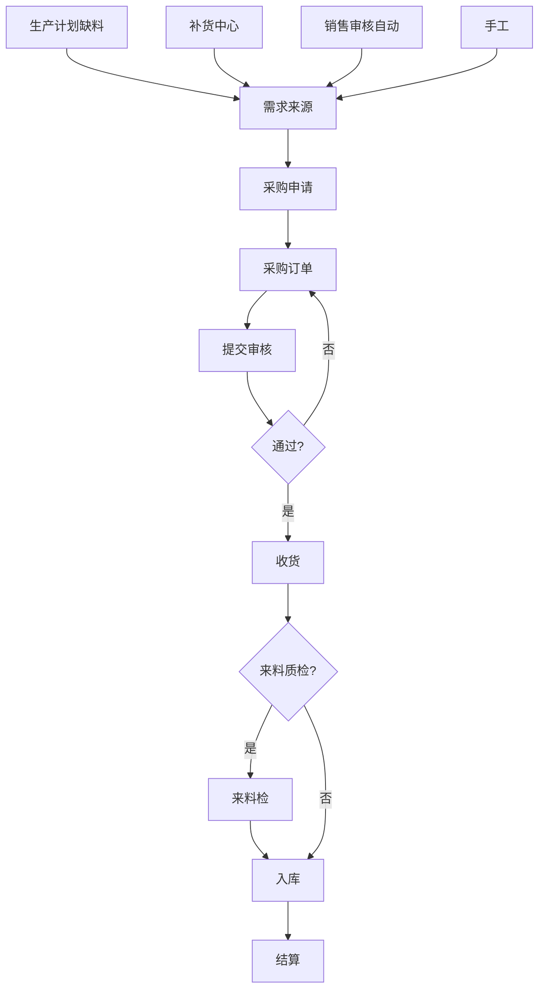

# 流程 · P04 采购闭环

## 1. 目标

缺料可见 → 申请 → 订单 → 收货入库 → 结算，与计划/补货/销售联动。

## 2. 流程图

## 3. 需求来源说明

| 来源     | 配置/入口                       |
| -------- | ------------------------------- |
| 生产计划 | 计划展开外购件                  |
| 补货中心 | 计划排产 → 库存预警             |
| 自动生成 | 功能参数自动生成 + 供应型态外购 |
| 手工     | 采购申请新增                    |

## 4. 状态要点

- 申请：草稿 → 待处理 → 处理中 → 处理完成 / 作废
- 订单：待提交 → 待审核 → 进行中 → 已完成 / 已终结 / 已作废
- 支持撤回、重新提交、价格变更

## 5. 与外协的差异

| 维度     | 采购            | 外协       |
| -------- | --------------- | ---------- |
| 对象     | 买标准件/原材料 | 委托加工   |
| 发料     | 通常无          | 有外协发料 |
| 质检     | 来料检          | 外协回货检 |
| 自动生成 | 采购申请        | 外协订单   |

工序外协见专项需求（机泵 1.6.1）。

## 6. 结算注意

- 维护结算规则（扣款、运费、按重等）
- 「按件库存、按重结算」企业必须提前对齐单位与换算
- 退货走采购退货，回写库存与对账

## 7. 验收用例

| #   | 用例                             | 期望                 |
| --- | -------------------------------- | -------------------- |
| 1   | 计划缺料生成申请→转订单→收货入库 | 库存增加、单据可追溯 |
| 2   | 补货中心一键采购申请             | 生成申请成功         |
| 3   | 价格变更（手动/自动审）          | 订单有效价更新       |
| 4   | 供应型态错误导致错单             | 能定位并关闭自动生成 |

## 8. 相关文档

- manuals/08
- `docs/yunxiao/...采购管理模块需求.md`
- `docs/yunxiao/...采购外协订单入库状态机需求.md`
- `docs/yunxiao/...库存预警与采购订单生成需求.md`
