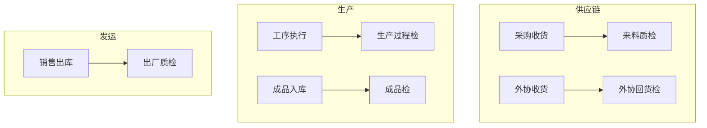

# 流程 · P05 质检五类

## 1. 目标

来料、外协回货、过程、成品、出厂五类检验留痕；按门控策略影响下游（当期弱管控）。

## 2. 五类与触发点



## 3. 标准执行流程

```
准备模板与检验项
  → 生成质检任务(建议Web)
  → 质检员领取/打开(Web或小程序)
  → 填检结果 / 拍照
  → 判定: 通过 / 不通过 / 部分通过
  → 部分通过: 填写处置数量(合格入库/退货/换货…)
  → 任务完成
  → (不合格) 报废 / 返工 / 退货闭环
```

## 4. 门控策略

| 策略        | 行为                             | 当期            |
| ----------- | -------------------------------- | --------------- |
| 弱管控 soft | Toast 预警，不拦截入库/报工/出库 | ✅ 开放         |
| 强管控 hard | 阻断下游                         | ⏳ 选项可能置灰 |

配置：功能参数 → 质量 → 质检门控（五类分别配置）。

## 5. 与报工/工资交叉

- 过程检不合格可对后续报工预警
- 报工不良分摊与质检不良分类应对齐字典
- 质量扣款规则写入计薪口径

## 6. 报废流程（简）

```
不合格评审 → 报废单 → 审批(可自动) → 入报废仓 → 补料/返工制度
```

## 7. 验收用例

| #   | 用例                       | 期望               |
| --- | -------------------------- | ------------------ |
| 1   | 主力产品出厂检模板执行一单 | 记录完整可回放     |
| 2   | 部分合格处置超数量         | 系统拦截           |
| 3   | 未做出厂检作出库           | 弱管控预警仍可出库 |
| 4   | 报废一单                   | 审批与库存可见     |

## 8. 实施顺序建议

场景四稳定 → 1～2 个产品模板 → 出厂检试点 → 来料/过程扩展。

## 9. 相关文档

- manuals/09、10
- `docs/yunxiao/...质量管理-五类质检功能需求.md`
