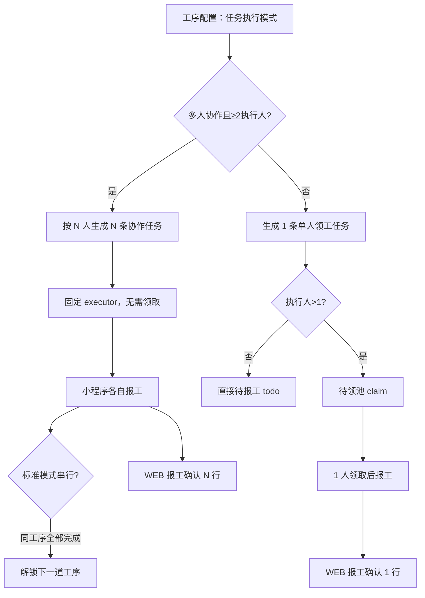

# 淄博泵产业互联网平台 · 1.5.2 迭代 · 多人协作工序任务

| 项目       | 内容                                                      |
| ---------- | --------------------------------------------------------- |
| 迭代       | 淄博泵产业互联网平台-1.5.2（机泵 1.5.2）                  |
| 模块       | 生产管理 / 工序配置 · 工单下发 · 工序报工（WEB + 小程序） |
| 需求负责人 | 邓利佳                                                    |
| 验收负责人 | 梁海曳                                                    |
| 更新日期   | 2026-07-07                                                |

> 本模块拆分为 **2 条独立需求**，请在云效「机泵1.5.2」迭代中分别创建工作项。  
> **不包含**「极简模式下隐藏工序操作选项」——该能力仅原型实现，不单独建需求。

---

## PR-152-01 多人协作工序任务

- **云效标题建议**：`WEB+小程序--工序报工--PR-152-01 多人协作工序任务`
- **优先级**：P1
- **需求负责人**：邓利佳
- **验收负责人**：梁海曳
- **状态**：原型已实现（待正式接口联调）
- **云效编号**：NYVC-1366

### 背景

部分生产工序（如装配、热处理、整机调试）为 **时长报工**，且需 **多名工人同时协作** 完成同一道工序。若仍按「单人领工」生成 1 条任务并放入待领池，会出现领工竞争、工时无法按人拆分、报工确认无法逐人核算等问题。

本需求引入 **任务执行模式**，支持在工序配置与工单下发时选择 **多人协作**，按执行人数生成多条独立子任务，各执行人分别报工、分别进入报工确认与工时核算。

### 适用条件（同时满足才拆分为协作任务）

| 条件         | 说明                             |
| ------------ | -------------------------------- |
| 报工类型     | **时长报工**                     |
| 资源类型     | **工人**（工人小组不适用本模式） |
| 任务执行模式 | **多人协作**（`collaborative`）  |
| 执行人数量   | 下发时 **≥ 2 人**                |

不满足上述条件时，仍走 **单人领工**（`single_claim`）既有逻辑：1 道工序 → 1 条任务；多执行人时进入待领池，由 1 人领取后报工。

### 功能逻辑总览



---

### 1. WEB · 工序配置

1. 工序新增/编辑表单增加 **任务执行模式**：
   - **单人领工**（默认）
   - **多人协作**
2. **展示条件**：仅当 **报工类型 = 时长报工** 且 **资源类型 = 工人** 时显示该字段；否则隐藏并重置为单人领工。
3. 工序列表/详情可展示任务执行模式（标准能力，非本需求核心验收项）。
4. **演示种子数据**：装配、热处理、整机调试默认设为多人协作。

---

### 2. WEB · 工单下发

1. 工序列表新增 **任务模式** 列，展示当前工序的执行模式（单人领工 / 多人协作）；非「时长报工 + 工人」时显示「—」。
2. 当工序为多人协作且已选 **≥ 2 名执行人** 时，执行人列下方提示：  
   `将按 N 名执行人生成 N 条协作任务`。
3. **下发校验**：多人协作工序若执行人 **< 2**，阻断下发并提示「请至少选择 2 名执行人」。
4. 下发成功后，按下文规则推送小程序任务，并同步生成报工确认行。

**适用工单类型**：生产工单、总装工单、外协工单等走 `mobileTaskDispatch` 的工单（与既有下发能力一致）。

---

### 3. 任务生成规则（WEB → 小程序）

#### 3.1 多人协作模式

对满足条件的工序，按 **执行人列表顺序** 生成 **N 条任务**（N = 执行人数）：

| 字段                                       | 规则                                                             |
| ------------------------------------------ | ---------------------------------------------------------------- |
| `taskGroupId`                              | `tg-{工单ID}-{工序序号}`，同工序子任务共用                       |
| `id`                                       | `mt-{工单ID}-{工序序号}-{槽位:02d}`，如 `mt-wo1-2-01`            |
| `taskNo`                                   | `T{日期YYYYMMDD}{工序序号:03d}-{槽位:02d}`，如 `T20260707002-01` |
| `taskExecutionMode`                        | `collaborative`                                                  |
| `collaborationSlot` / `collaborationTotal` | 当前序号 / 总人数，如 `1/3`                                      |
| `executor`                                 | **固定** 为对应执行人，不进入待领池                              |
| `placement`                                | `todo`（今日待报工直接可见）                                     |
| `taskStatus`                               | `待开始`                                                         |

#### 3.2 单人领工模式（对照）

| 场景       | 任务数 | 放置位置       | 说明                             |
| ---------- | ------ | -------------- | -------------------------------- |
| 1 名执行人 | 1      | `todo`         | 直接待报工                       |
| 多名执行人 | 1      | `claim` 待领池 | 任 1 人领取，领取后绑定 executor |

#### 3.3 串行工序（标准生产模式）

- 标准模式下，非首道工序任务默认 `serialLocked: true`，上一道工序（同 `processSeq` 组）**全部子任务**完成后才解锁。
- **协作工序解锁条件**：同一 `workOrderId` + 同一 `processSeq` 下 **所有协作子任务** 均为「已完成」，才解锁 `processSeq + 1` 的任务。
- 极简报工并行下发规则见关联需求，不在本工作项范围。

---

### 4. WEB · 报工确认

1. 协作模式下，同一工序按执行人生成 **N 条报工确认行**（与 N 条小程序任务一一对应）。
2. 行 ID 规则：`rc-{工单ID}-{工序序号}-{槽位:02d}`。
3. 任务编号与协作槽位与小程序任务保持一致，便于逐人审核、逐人推送工时工资。

单人领工仍为 1 工序 1 行：`rc-{工单ID}-{工序序号}`。

---

### 5. 小程序 · 工序报工

#### 5.1 任务列表

1. **协作任务不出现在「待领任务」** 列表（无需领取）。
2. **今日待报工** 直接展示分配给当前用户的协作任务。
3. 任务卡片展示 **协作** 标签及 `协作 M/N` 文案。

#### 5.2 任务详情 / 报工页

1. 展示 **协作进度** 区块：同工序各执行人姓名、任务状态（待开始 / 执行中 / 已完成）。
2. 报工页顶部同步展示协作进度，便于现场互看完成情况。
3. **时长报工**：各执行人 **独立填报工时**，提交后 **该子任务直接完成**（不按件数累计）。
4. 不提供「替他人报工」——每人只操作自己的协作子任务。

#### 5.3 与小组报工区分

| 维度     | 多人协作（工人） | 工人小组           |
| -------- | ---------------- | ------------------ |
| 任务拆分 | 按执行人数 N 条  | 通常 1 条          |
| 领取     | 不需要           | 组长领取/分发      |
| 报工主体 | 固定执行人各自报 | 组长代报或组内成员 |

---

### 6. 业务规则汇总

1. 任务执行模式在 **工序主数据** 维护，工单下发可继承；下发时以工单工序 + 工序配置合并后的有效值为准。
2. 多人协作 **仅适用于时长报工 + 工人**；计件类报工、工人小组不走协作拆分。
3. 协作任务 **不占用待领池**；单人领工多执行人仍走待领池。
4. 标准串行模式下，**以工序序号（processSeq）为组** 判断整组是否完成，协作子任务须全部完成后才解锁下一道。
5. 报工确认、工时工资推送按 **子任务 / 子确认行** 粒度处理，人数 = 协作任务数。

---

### 7. 验收标准

- [ ] 工序配置：时长报工+工人时可设「多人协作」；其他组合不展示该字段
- [ ] 工单下发：展示任务模式列；多人协作且 ≥2 人时显示生成 N 条任务提示
- [ ] 下发校验：多人协作 <2 人时阻断并提示
- [ ] 下发后小程序生成 N 条任务，executor 固定、无需领取
- [ ] 任务编号符合 `T{日期}{工序序号}-{槽位}` 规则
- [ ] 小程序待领列表不出现协作任务；今日待报工可见
- [ ] 任务详情/报工页展示协作进度（M/N 及同伴状态）
- [ ] 各执行人独立提交时长报工，互不影响
- [ ] WEB 报工确认生成 N 行，与子任务 ID/编号对应
- [ ] 标准串行模式：同工序全部协作子任务完成后才解锁下一道工序

---

## WO-152-01 极简报工工单下发隐藏投料列

- **云效标题建议**：`WEB--工单下发--WO-152-01 极简报工隐藏投料信息列`
- **优先级**：P1
- **需求负责人**：邓利佳
- **验收负责人**：梁海曳
- **状态**：原型已实现（待正式接口联调）
- **云效编号**：NYVC-1367

### 背景

**极简报工**场景下，现场更关注快速下发与报工，工序级投料维护增加操作负担且与 EBOM 领料并行存在。需在 WEB 工单下发页简化界面：**隐藏投料信息列**，下发时可不为工序配置投料。

> 本需求 **独立于** MR-152-02 工单领料，便于分模块评审与排期；与领料需求存在业务联动，见下文关联说明。

### 触发条件

**业务规则 → 生产模式 ≠ 标准模式** 时生效，包括：

- **极简报工**（`minimal`）
- **下发即报工**（`minimal_salary`）

标准模式（`standard`）仍展示投料信息列，行为与改造前一致。

### 功能描述

1. WEB **生产工单 / 总装工单 / 外协工单** 等工单下发 Tab，工序表格 **不展示「投料信息」列**（含「+ 增加投料」入口）。
2. 下发保存/下发并开始时 **不要求** 维护工序投料明细。
3. 已保存的投料数据（若历史工单在标准模式下配置过）在切换模式后不在界面展示；切回标准模式后恢复展示与编辑。
4. **不影响** 工单 EBOM、组件 Tab 等其它 BOM/物料能力。

### 业务联动（与 MR-152-02）

1. 下发 **未配置工序投料** 时，工人仍可通过小程序 **工单领料** 按 **工单 EBOM** 领料（不依赖工序投料配置）。
2. 极简报工下领料出库免审批、免收货确认、工单完成自动扣减库存等规则，仍以 **MR-152-02** 为准。

### 验收标准

- [ ] 极简报工 / 下发即报工：工单下发工序列表无「投料信息」列
- [ ] 上述模式下可不填投料正常保存、下发
- [ ] 标准模式：投料列正常展示，可增删投料行
- [ ] 切换生产模式后投料列显隐即时生效
- [ ] 无投料配置不影响小程序工单领料（EBOM 仍可用）

---

## 云效批量建需求建议

| 工作项标题                                       | 类型       | 迭代      | 优先级 | 云效编号  |
| ------------------------------------------------ | ---------- | --------- | ------ | --------- |
| WEB+小程序--工序报工--PR-152-01 多人协作工序任务 | 产品类需求 | 机泵1.5.2 | P1     | NYVC-1366 |
| WEB--工单下发--WO-152-01 极简报工隐藏投料信息列  | 产品类需求 | 机泵1.5.2 | P1     | NYVC-1367 |

**建单步骤**

1. 进入云效项目 **淄博泵产业互联网平台** → 迭代 **机泵1.5.2**。
2. 新建 **产品类需求**，标题使用上表「工作项标题」。
3. **描述正文**：分别复制上方 `## PR-152-01` 或 `## WO-152-01` 章节到工作项描述。
4. 需求规划节点：**期初**；需求负责人：邓利佳；验收负责人：梁海曳。

**描述模板（复制到云效）**

```
【需求编号】PR-152-01 / WO-152-01
【迭代】机泵1.5.2
【模块】生产管理

（粘贴对应章节的 背景、功能描述、业务规则、验收标准）

【关联】
- PR-152-01 ↔ 工序配置、工单下发、报工确认、小程序工序报工
- WO-152-01 ↔ 业务规则（生产模式）、MR-152-02 工单领料
```

---

## 关联需求

| 编号         | 说明                                                           |
| ------------ | -------------------------------------------------------------- |
| MR-152-02    | 工单领料（含批量领料）；投料列隐藏见 **NYVC-1367 / WO-152-01** |
| WO-151-02    | 工单下发基础能力（工序内容、执行人等）                         |
| MP-PR-151-01 | 小程序工序报工基础能力                                         |
