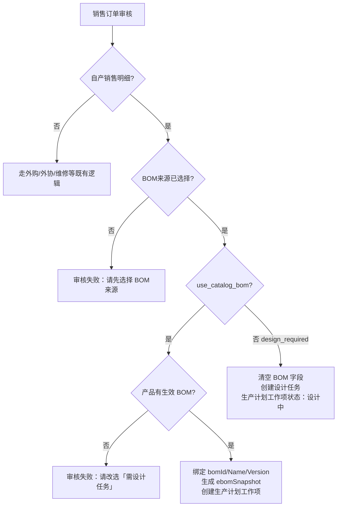
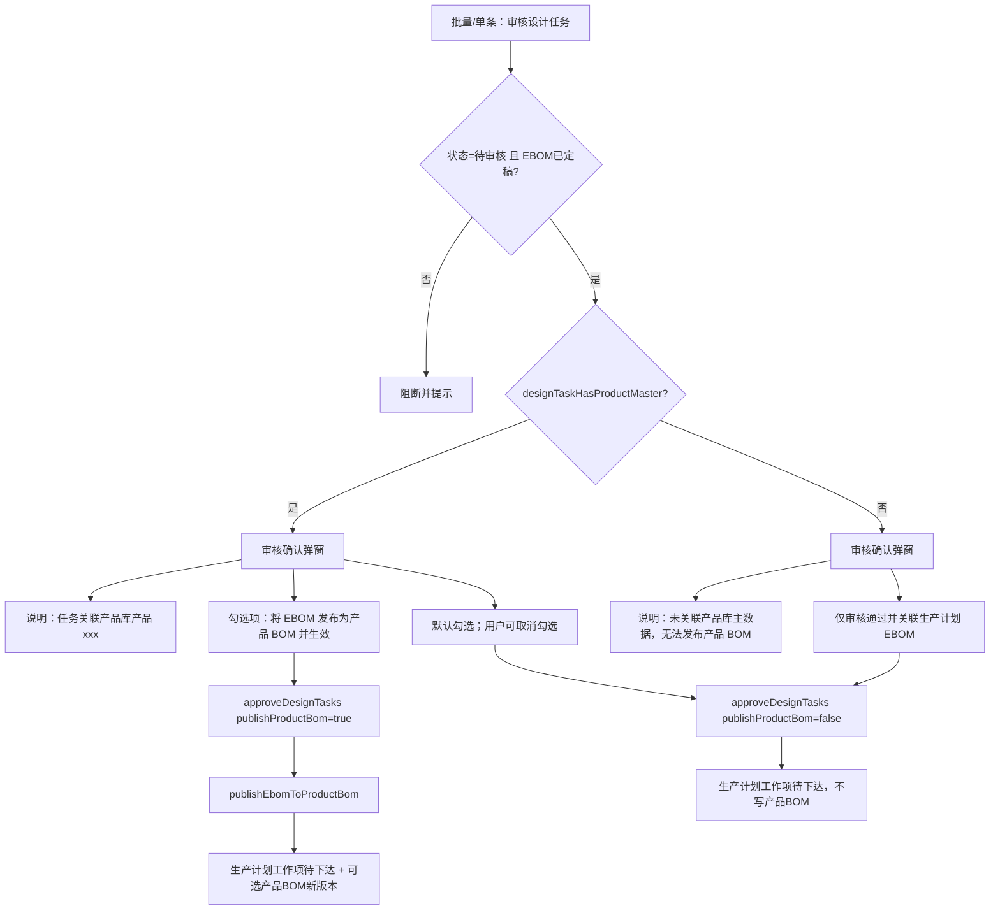
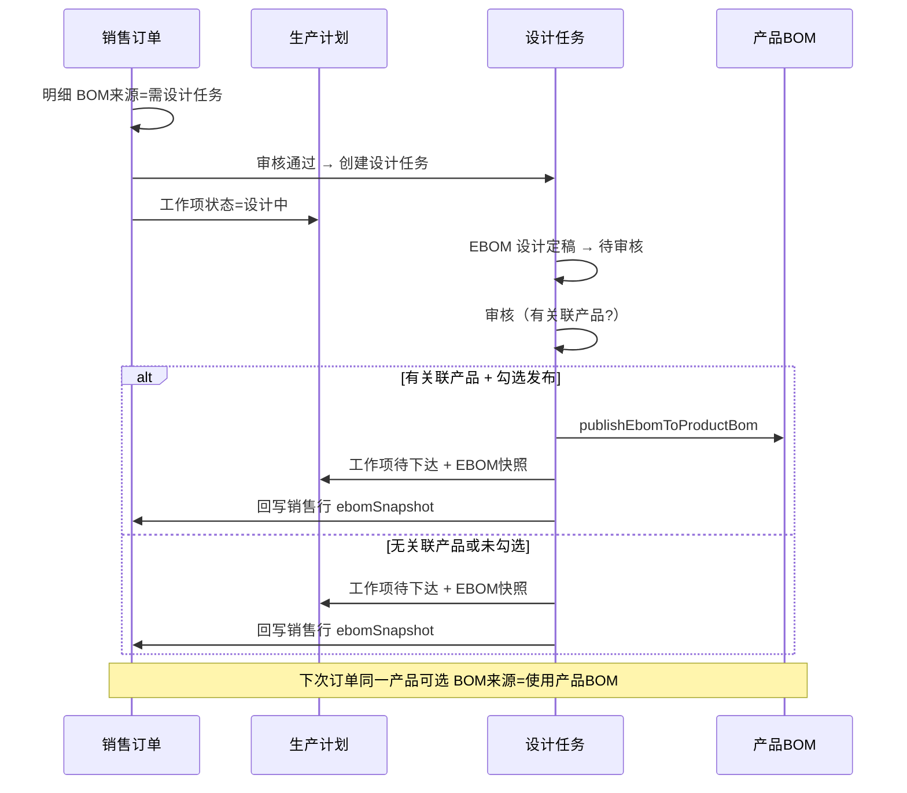

# 淄博泵产业互联网平台 · 1.5.2 迭代 · 销售订单 BOM 来源与设计任务审核

| 项目       | 内容                                      |
| ---------- | ----------------------------------------- |
| 迭代       | 淄博泵产业互联网平台-1.5.2（机泵 1.5.2）  |
| 模块       | 销售管理 / 销售订单 · 计划排产 / 设计任务 |
| 需求负责人 | 邓利佳                                    |
| 验收负责人 | 梁海曳                                    |
| 更新日期   | 2026-07-09                                |

> 本模块拆分为 **2 条独立需求**，请在云效「机泵1.5.2」迭代中分别创建工作项。  
> 两条需求存在先后依赖：**SO-152-01** 明确销售侧「何时生成设计任务」；**DT-152-01** 明确设计侧「审核通过后是否回写产品 BOM」。

---

## 背景与改造动机

### 原逻辑（待废弃）

早期销售订单审核对自产明细的处理，隐含依赖 **产品属性**（如「定制产品」「定制-成品零部件」）判断是否走设计任务、是否校验产品 BOM：

| 判断依据          | 行为                                                          |
| ----------------- | ------------------------------------------------------------- |
| 产品属性 = 定制类 | 审核后不校验 BOM，自动生成设计任务                            |
| 产品属性 = 标准类 | 审核前/后校验产品是否存在 **使用中 BOM**，无 BOM 则阻断或提示 |

该方式存在明显问题：

1. **产品属性** 是主数据分类字段，不应承担 **履约路径** 决策；
2. 同一标准产品也可能因订单差异需要重新设计（无 BOM 或需改型）；
3. 销售明细已引入 **「BOM来源」** 字段（`bomFulfillmentPath`），与 UI 选项「使用产品BOM / 需设计任务」一致，但历史文档、数据迁移、部分校验仍残留产品属性分支。

### 目标逻辑（统一口径）

**销售订单审核** 仅根据明细行 **「BOM来源」** 决定后续链路，不再读取产品属性做 BOM/设计任务分支。

**设计任务审核** 在通过 EBOM 定稿后，判断任务是否关联 **产品库主数据**；若关联，则向用户明确提示是否 **将 EBOM 发布为产品 BOM**，供后续订单复用。

---

## SO-152-01 销售订单审核改由「BOM来源」驱动设计任务

- **优先级**：P0
- **需求负责人**：邓利佳
- **验收负责人**：梁海曳
- **需求规划节点**：期初
- **状态**：已实现

### 一、功能梳理

#### 1.1 字段与枚举

| 界面名称 | 字段                 | 枚举值            | 含义                         |
| -------- | -------------------- | ----------------- | ---------------------------- |
| BOM来源  | `bomFulfillmentPath` | `use_catalog_bom` | 使用产品库当前生效 BOM       |
| BOM来源  | `bomFulfillmentPath` | `design_required` | 需设计任务（不绑定产品 BOM） |

> 已移除「暂缓等待 BOM」（`pending_bom`）选项；历史数据迁移为 `design_required` 或按行内已有值保留只读展示。

**适用范围**：业务类型为 **自产销售** 的明细行。外购/外协/维修服务等不适用 BOM来源。

**默认值**（`suggestDefaultFulfillmentPath`）：

| 条件                           | 默认 BOM来源             |
| ------------------------------ | ------------------------ |
| 产品库选品 + 有生效 BOM        | 使用产品BOM              |
| 产品库选品 + 无生效 BOM        | 需设计任务               |
| 手工添加明细（`isManualLine`） | 需设计任务（自产销售时） |

#### 1.2 销售订单审核流程（目标）



**关键原则**：

- **不再** 根据 `productAttr`（定制产品 / 标准产品等）决定是否生成设计任务；
- **不再** 因产品属性为「定制」而跳过 BOM 校验或强制走设计；
- 是否走设计任务 **唯一** 看 `bomFulfillmentPath === design_required`。

#### 1.3 与现有代码对照

| 模块       | 文件                                                             | 现状                                                  | 改造项                                               |
| ---------- | ---------------------------------------------------------------- | ----------------------------------------------------- | ---------------------------------------------------- |
| 审核主流程 | `salesOrderStore.js` → `approveSalesOrder`                       | 已按 `bomFulfillmentPath` 分流                        | 移除 `pending_bom` 分支；确认无产品属性判断          |
| 审核前校验 | `salesOrderFulfillment.js` → `validateFulfillmentPathForApprove` | 已校验 BOM来源                                        | 保留；与产品属性解耦                                 |
| 历史迁移   | `salesOrderFulfillment.js` → `migrateLineFulfillmentPath`        | **仍含** `isCustomProductAttribute(line.productAttr)` | **删除** 产品属性分支，仅按 BOM来源/BOM 是否存在迁移 |
| 常量       | `designTask.js` → `CUSTOM_PRODUCT_ATTRIBUTES`                    | 注释为「需自动生成设计任务」                          | 标注废弃或仅 EBOM 展示用，不参与审核                 |
| 文档       | `销售订单EBOM需求.md` §1.1/1.2                                   | 仍写「定制产品走设计任务」                            | **修订** 为 BOM来源 口径                             |
| 文档       | `销售订单维修服务需求.md` §定制销售                              | 写「审核走定制逻辑」                                  | **修订**：定制销售默认 BOM来源=需设计任务            |
| Mock/Seed  | `salesOrderSeed.js`                                              | 部分行仍靠 `productAttr: 定制产品`                    | 改为显式 `bomFulfillmentPath: design_required`       |

#### 1.4 销售明细侧（已实现，验收即可）

- 编辑明细 / 列表：自产销售行展示 **BOM来源**、**BOM名称+版本**；
- 无 BOM 产品默认 **需设计任务**；
- 产品库选品行不可选「定制销售」业务类型（定制仅手工行）。

#### 1.5 审核后产出对照

| BOM来源     | 设计任务         | 生产计划工作项   | EBOM 快照                 | 产品 BOM |
| ----------- | ---------------- | ---------------- | ------------------------- | -------- |
| 使用产品BOM | 不生成           | 待下达（有快照） | 审核时从 product BOM 生成 | 不变更   |
| 需设计任务  | 自动生成 1 条/行 | 设计中           | 无（待设计任务定稿）      | 不变更   |

### 二、业务规则

1. 自产销售明细 **必须** 选择 BOM来源 后方可审核。
2. 选择「使用产品BOM」时，必须存在 **使用中** 的产品 BOM，否则审核失败。
3. 选择「需设计任务」时，不校验产品 BOM；审核通过后创建设计任务，生产计划对应工作项为「设计中」。
4. **产品属性**（`productAttr`）仅作展示/报表，**不参与** 审核分支。
5. 手工添加明细（无 `productId`）仅可选「需设计任务」，不可选「使用产品BOM」。

### 三、验收标准

- [ ] 标准产品 + BOM来源=使用产品BOM：审核成功，生成 EBOM 快照与生产计划，**不** 生成设计任务。
- [ ] 标准产品 + 无 BOM + BOM来源=需设计任务：审核成功，生成设计任务，**不** 因「标准产品」属性阻断。
- [ ] 产品属性=定制产品 + BOM来源=使用产品BOM + 有 BOM：审核成功，**不** 自动生成设计任务。
- [ ] 产品属性=标准产品 + BOM来源=需设计任务：审核成功，生成设计任务。
- [ ] 未选 BOM来源：审核失败，提示选择 BOM来源。
- [ ] 选使用产品BOM 但无生效 BOM：审核失败，提示改选需设计任务。
- [ ] 历史订单迁移后，明细 BOM来源 正确，不因 productAttr 被改写。
- [ ] `销售订单EBOM需求.md` 等文档与现网逻辑一致。

### 四、非范围

- 设计任务 EBOM 设计页本身（见 DT-151 系列）；
- 设计任务审核后发布产品 BOM（见 **DT-152-01**）；
- 小程序端。

---

## DT-152-01 设计任务审核：产品主数据校验与发布产品 BOM 提示

- **优先级**：P0
- **需求负责人**：邓利佳
- **验收负责人**：梁海曳
- **需求规划节点**：期初
- **状态**：已实现

### 一、功能梳理

#### 1.1 业务场景

销售订单明细 BOM来源=**需设计任务** → 审核后产生设计任务 → 设计人员完成 EBOM 并提交待审核 → **校核人审核设计任务**。

此时需区分：

| 设计任务是否关联产品库主数据                          | 典型来源                        | 审核通过后的期望                                                                         |
| ----------------------------------------------------- | ------------------------------- | ---------------------------------------------------------------------------------------- |
| **是**（有 `productId` 且产品存在于产品库，非手工行） | 产品库选品但 BOM来源=需设计任务 | 可选：将定稿 EBOM **发布为产品 BOM**（生效），后续订单可选「使用产品BOM」                |
| **否**（手工行 / 无 productId / 产品不在库）          | 手工「添加产品」、外协定制等    | 仅关联生产计划 EBOM，**不提供** 发布产品 BOM；提示用户先维护产品主数据（若业务需要入库） |

#### 1.2 产品主数据判定（现有实现）

工具函数：`designTaskHasProductMaster(task)`（`utils/designTaskProductMaster.js`）

```
true  当且仅当：
  - task.productId 存在
  - 产品库中存在对应产品
  - 非销售手工行（isManualLine !== true）
  - 来源为销售订单时，对应销售明细非 isManualLine
```

#### 1.3 审核交互流程（目标）



#### 1.4 与现有代码对照

| 模块       | 文件                                          | 现状                                                 | 改造项                                                             |
| ---------- | --------------------------------------------- | ---------------------------------------------------- | ------------------------------------------------------------------ |
| 审核弹窗   | `DesignTaskView.vue`                          | 有关联主数据时显示勾选框                             | 增加 **说明文案**：产品编码/名称；无主数据时 **明确提示** 不可发布 |
| 审核逻辑   | `designTaskStore.js` → `onDesignTaskApproved` | `publishProductBom` 时调用 `publishEbomToProductBom` | 保持；失败时阻断审核并返回原因                                     |
| 发布实现   | `publishEbomToProductBom.js`                  | EBOM → 产品 BOM 保存并 `enableProductBom`            | 验收覆盖：首版发布 / 升版                                          |
| 主数据判定 | `designTaskProductMaster.js`                  | 已实现                                               | 补充单元/手工测试用例说明                                          |

#### 1.5 审核弹窗文案（建议）

**有关联产品主数据时：**

> 任务关联产品库产品：**{productCode} {productName}**  
> 审核通过后，生产计划工作项将关联本次 EBOM。  
> ☑ 将本次 EBOM **发布为产品 BOM**（生效），供后续销售订单选择「使用产品BOM」复用。

**无关联产品主数据时：**

> 当前设计任务 **未关联产品库主数据**（手工录入或无产品编码），无法发布为产品 BOM。  
> 审核通过后仅更新生产计划 EBOM；若需入库复用，请先在 **产品信息** 维护主数据后再发布 BOM。

#### 1.6 发布产品 BOM 规则

1. 仅当用户 **勾选** 且 `designTaskHasProductMaster(task) === true` 时执行发布。
2. 发布内容：已定稿 EBOM 的树节点与物料行 → 产品 BOM（`saveProductBom` + `enableProductBom`）。
3. 产品已有生效 BOM：发布为 **新版本** 并生效；无生效 BOM：创建并生效。
4. 发布失败（产品不存在、结构为空等）：**审核整体失败**，不改变任务为已通过。
5. 不勾选时：仅 `applyEbomToPlanWorkItem` + 回写销售行 `ebomSnapshot`，不写产品 BOM。

### 二、业务规则

1. 设计任务审核前置条件：EBOM 状态为 **定稿**（`EBOM_STATUS.FINALIZED`）。
2. **产品主数据** 指产品信息模块中存在的成品/部件记录，与「产品属性是否定制」无关。
3. 发布产品 BOM 为 **可选** 操作，默认勾选（有关联主数据时）；业务上允许仅本次订单使用 EBOM 而不回写产品库。
4. 手工销售明细产生的设计任务：不提供发布产品 BOM，避免无编码产品污染产品库。
5. 发布成功后提示应包含：产品 BOM 版本号；生产计划、销售订单 EBOM 快照同步结果。

### 三、验收标准

- [ ] 关联产品库的设计任务：审核弹窗展示产品编码/名称及「发布为产品 BOM」勾选项，默认勾选。
- [ ] 勾选发布：审核通过后产品 BOM 库可见新版本/首版且为 **生效** 状态。
- [ ] 不勾选发布：审核通过，生产计划 EBOM 正确，产品 BOM 库无变化。
- [ ] 未关联产品主数据：弹窗提示无法发布，无勾选框；审核通过后仅更新计划 EBOM。
- [ ] 发布失败：任务保持待审核，展示失败原因。
- [ ] 销售订单来源任务：审核通过后销售明细 `ebomSnapshot` 与生产计划工作项状态为「待下达」。
- [ ] 批量审核：仅对含主数据的任务显示勾选；混合批次行为符合预期（或统一说明文案）。

### 四、非范围

- 手工新增设计任务（无销售订单）的发布策略扩展；
- EBOM 设计页 UI；
- 自动创建产品主数据（需用户先在 product info 维护）。

---

## 端到端串联（SO-152-01 + DT-152-01）



---

## 云效批量建需求建议

| 工作项标题                                                | 类型       | 迭代      | 优先级 | 云效编号  |
| --------------------------------------------------------- | ---------- | --------- | ------ | --------- |
| WEB--销售订单--SO-152-01 审核改由 BOM来源 驱动设计任务    | 产品类需求 | 机泵1.5.2 | P0     | NYVC-1378 |
| WEB--设计任务--DT-152-01 审核校验产品主数据与发布产品 BOM | 产品类需求 | 机泵1.5.2 | P0     | NYVC-1379 |

> **说明**：可通过云效 MCP 自动建单；亦可在云效 Web 端按下列步骤手动补建。

**建单步骤**

1. 登录 [云效 DevOps](https://devops.aliyun.com/) → 项目 **淄博泵产业互联网平台** → 迭代 **机泵1.5.2**。
2. 点击 **新建工作项** → 类型选 **产品类需求**。
3. **标题** 使用上表「工作项标题」（两条各建一条）。
4. **描述正文**：打开本文件，复制对应 `## SO-152-01` 或 `## DT-152-01` 整章（含背景、流程、业务规则、验收标准）粘贴到工作项描述。
5. **优先级** P0；**需求规划节点** 期初；**需求负责人** 邓利佳；**验收负责人** 梁海曳。
6. SO-152-01 与 DT-152-01 可并行；DT-152-01 依赖 SO-152-01 已能稳定产生「需设计任务」来源的设计任务。

**描述模板（复制到云效）**

```
【需求编号】SO-152-01 或 DT-152-01
【迭代】机泵1.5.2
【模块】销售管理 / 设计任务
【状态】已实现（代码见 i-doms-web 对应路径）

（粘贴对应章节的 背景、功能梳理、业务规则、验收标准）
```

**描述正文**：复制上方对应 `## SO-152-01` / `## DT-152-01` 章节（含背景、流程、业务规则、验收标准）到云效工作项描述中。

**依赖关系**

- SO-152-01 应先于或与 DT-152-01 并行开发；DT-152-01 依赖销售侧已能稳定产生「需设计任务」来源的设计任务。
- 与 1.5.1 文档关系：需 **修订** `销售订单EBOM需求.md`、`设计任务需求.md` 中仍写「定制产品属性决定设计任务」的段落，指向本 1.5.2 口径。

**关联代码路径（开发自检）**

```
src/store/salesOrderStore.js          # approveSalesOrder
src/constants/salesOrderFulfillment.js
src/views/sales/components/CreateSalesOrderModal.vue
src/views/sales/components/SalesOrderLineEditModal.vue
src/views/planning/DesignTaskView.vue
src/store/designTaskStore.js
src/utils/designTaskProductMaster.js
src/utils/publishEbomToProductBom.js
```
